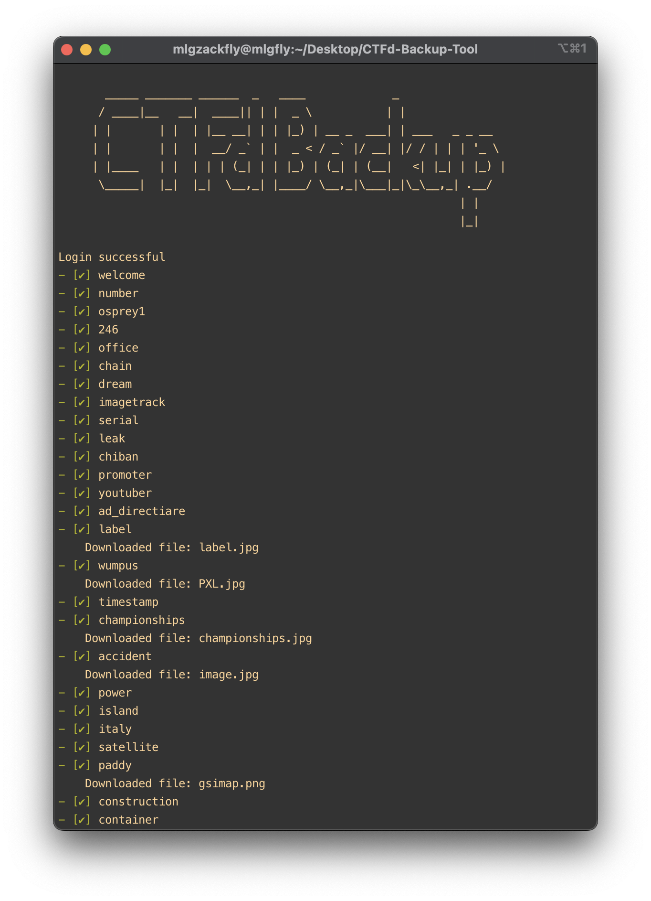

# CTFd Backup Tool

## Introduction
CTFd Backup Tool is a Python script for backing up data from CTFd (Capture The Flag platform) instances. This tool helps users to create backups of challenges, teams, users, scoreboard, and an overview file for easy writeup creation. It allows you to maintain a local copy of your CTFd data for offline usage or disaster recovery.

## Features
- Backup challenges, teams, users, scoreboard, and an overview file.
- Organize challenges by category in the overview file for easy writeup creation.
- Retrieve data from CTFd instances via API.
- Save challenges including descriptions and files.
- Download files associated with challenges.
- User-friendly command-line interface.

## Installation
1. Clone this repository:

    ```bash
    git clone https://github.com/mlgzackfly/CTFd-Backup-Tool.git
    ```

2. Navigate to the cloned directory:

    ```bash
    cd ctfd-backup-tool
    ```

3. Install the required dependencies:

    ```bash
    pip install -r requirements.txt
    ```

## Usage
1. Navigate to the directory where the script is located.
2. Run the script using Python:

    ```bash
    python ctfbackup.py <username> <password> <url>
    ```

    Replace `<username>`, `<password>`, and `<url>` with your CTFd credentials and URL.
3. The script will start backing up your CTFd instance. Once completed, you will find the backups in the `CTFd_Backup` directory.

## Example
```bash
python ctfbackup.py admin password https://ctfd.example.com
```


